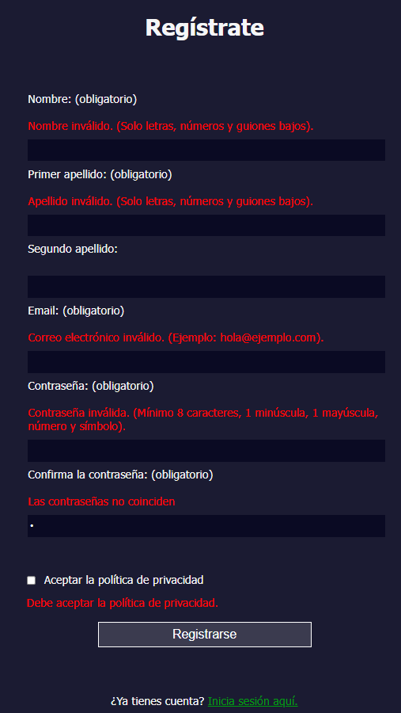
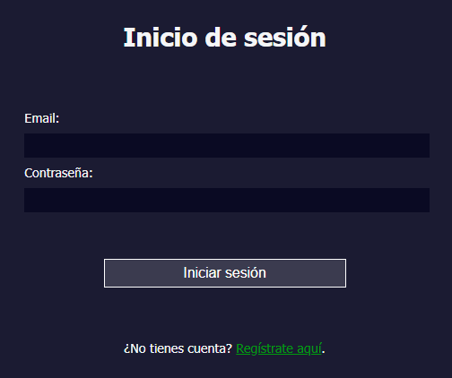

# Login

### Funcionalidades
En el formulario de registro se comprueba que todos los datos introducidos tengan el formato correcto.

* **Nombre y primer apellido:** Solo se pueden utilizar letras, números guiones bajos y tienen entre 3 y 20 caracteres.
* **Correo electrónico:** Tiene que seguir el formato de un email típico. Del estilo _hola@hola.com_.
* **Contraseña de acceso:** Al menos 8 caracteres, al menos una minúscula, una mayúscula, un número y un símbolo.
* **Confirmación de contraseña:** Deben coincidir ambas contraseñas.
* **Política de privacidad:** Por defecto está desmarcada y tiene que marcarse para poder registrarse.

### Login
Se incluye una página de inicio de sesión funcional. En el código JavaScript se han definido un correo y contraseña válidos para comprobar.

#### Realizado por los alumnos Isaac Alonso y Juan Álvaro Flórez

